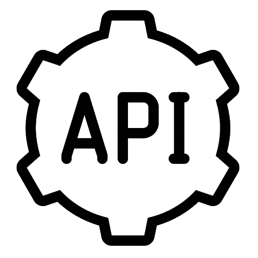

# Chatie Restful API

[](https://redocly.github.io/redoc/?url=https://raw.githubusercontent.com/Chatie/api/master/spec/swagger.yaml)



> Credit: [Icon Library](http://icon-library.com/icon/rest-api-icon-19.html)

Chatie Restful API, Powered by OpenAPI Specifiction(f.k.a. Swagger)

- [Swagger Editor Online](http://editor.swagger.io/#/?import=https://raw.githubusercontent.com/Chatie/api/master/spec/swagger.yaml)
- [Swagger Generator](https://generator.swagger.io/?url=https://raw.githubusercontent.com/Chatie/api/master/spec/swagger.yaml)


## Motivation

Describe our RESTful APIs in [OpenAPI Specification](https://en.wikipedia.org/wiki/OpenAPI_Specification), which is an Interface Description Language under Linux Foundation, former [Swagger](https://en.wikipedia.org/wiki/Swagger_(software)). We believe our API will be improved greatly after the specification has been implemented.

## Princinples: Spec-Driven Development

- [What is Spec Driven Development](https://www.mikestowe.com/blog/2014/11/what-is-spec-driven-development.php)
- [Building Your API for Longevity, Part 1: Spec-Driven Development](https://www.nginx.com/blog/building-api-for-longevity-spec-driven-development/)

## Code Generator

We can generate both server and client code from OpenAPI Specification file.

### Server

```shell
cd server
../node_modules/.bin/yo swaggerize --framework=express --apiPath=../spec/swagger.yaml
```

### Client

```shell
```

## gRPC to OpenAPI Specification

- [gRPC to JSON proxy generator following the gRPC HTTP spec](https://github.com/grpc-ecosystem/grpc-gateway) ([talk video](https://youtu.be/Pq1paKC-fXk))

## OAS3 Generators

Spec/Design Driven Development Tools:

- [horiuchi/dtsgenerator - TypeScript d.ts file generate from JSON Schema file](https://github.com/horiuchi/dtsgenerator)
- [openapitools/openapi-generator - Generator for server stubs for OpenAPI Spec v3 (writen in Java)](https://github.com/openapitools/openapi-generator)
- [swagger-api/swagger-codegen - a template-driven engine to generate server stubs by parsing your OpenAPI / Swagger definition](https://github.com/swagger-api/swagger-codegen)
- [Mermade/openapi-codegen - OpenAPI 3.0 CodeGen plus Node.js minus the Java and emojis](https://github.com/Mermade/openapi-codegen)
- [fmvilas/swagger-node-codegen](https://github.com/fmvilas/swagger-node-codegen)

## Toolsets

- [cdimascio/express-openapi-validator - Auto-validates api requests, responses, and securities using ExpressJS and an OpenAPI Specification 3](https://github.com/cdimascio/express-openapi-validator)

## See Also

- [OpenAPI/Swagger-generated API Reference Documentation](https://redocly.github.io/redoc/)
- [Design Drivin API Development](http://www.slideshare.net/sofj/design-driven-api-development)
- [OpenAPI Initiative](https://www.openapis.org/)
- [Swagger Server Sample 3](https://github.com/BigstickCarpet/swagger-server/tree/master/samples/sample3)
- [Swaggerize Examples](https://github.com/subeeshcbabu/swaggerize-examples)
- [The Anatomy of a JSON Web Token](https://scotch.io/tutorials/the-anatomy-of-a-json-web-token)
- [Authenticate a Node.js API with JSON Web Tokens](https://scotch.io/tutorials/authenticate-a-node-js-api-with-json-web-tokens)
- [An Introduction to OAuth 2](https://www.digitalocean.com/community/tutorials/an-introduction-to-oauth-2)
- [Design Driven Development](http://www.slideshare.net/henrydjacob/design-driven-development)
- [Intro to RAML - API Spec Driven Development](http://www.hksilicon.com/articles/1082744)
- [LoopBack - Defining the API using code-first approach](https://loopback.io/doc/en/lb4/Defining-the-API-using-code-first-approach.html#define-the-api-from-code-first-approach)
- [LoopBack - OpenAPI generator](https://loopback.io/doc/en/lb4/OpenAPI-generator.html)
- [OpenAPI.Tools](https://openapi.tools)

## History

### master

### 0.1 Apr 20, 2020

1. Upgrade Spec from Swagger 2.0 to OpenAPI 3.0 with the help of [Mermade Swagger 2.0 to OpenAPI 3.0.0 converter](https://mermade.org.uk/openapi-converter) [#2](https://github.com/Chatie/api/issues/2)
1. Enable DevOps Tools

### 0.0.1 Feb 19, 2017

Initial version

- Add [Swagger Online Editor](http://editor.swagger.io/#/?import=https://raw.githubusercontent.com/Chatie/api/master/spec/swagger.yaml)
- Add [Redocly Online Viewer](https://redocly.github.io/redoc/?url=https://raw.githubusercontent.com/Chatie/api/master/spec/swagger.yaml)
- Add [OpenAPI Specification Schema Validation](https://online.swagger.io/validator?url=https://raw.githubusercontent.com/Chatie/api/master/spec/swagger.yaml)

## Author

[Huan LI](https://github.com/huan)
([李卓桓](http://linkedin.com/in/zixia)),
Tencent TVP of Chatbot, \<zixia@zixia.net\>

[](https://stackexchange.com/users/265499)

## Copyright & License

- Code & Docs © 2017-now Huan LI \<zixia@zixia.net\>
- Code released under the Apache-2.0 License
- Docs released under Creative Commons
